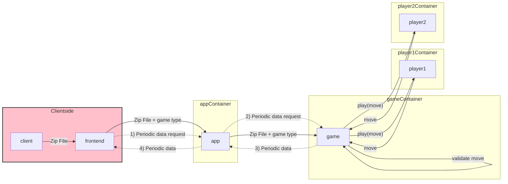
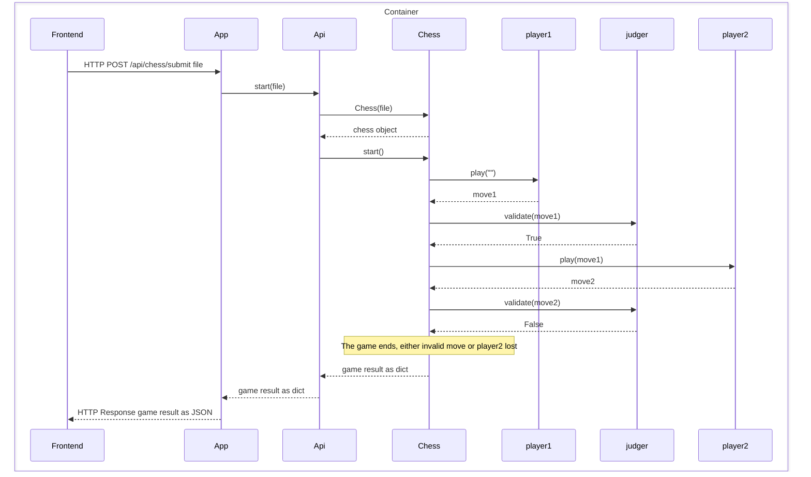
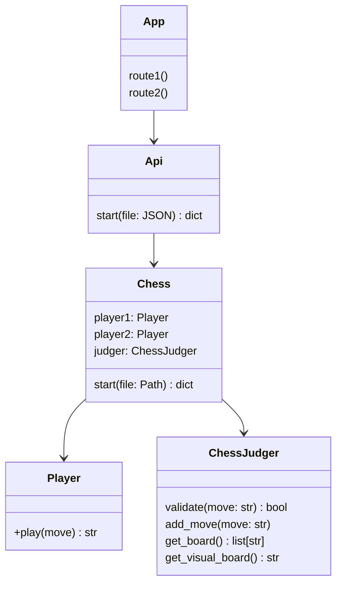

# Architecture

## Submitting file from front-end and run chess game

## Container Game Flow

```mermaid
graph LR
    client -- Zip File --> frontend

    frontend -- Zip File + game type --> app

    frontend -. 1) Periodic data request .-> app
    app -. 2) Periodic data request .-> game
    game -. 3) Periodic data .-> app
    app -. 4) Periodic data .-> frontend
    app -- Zip File + game type --> game
    game -- play(move) --> player1
    player1 -- move --> game
    game -- play(move) --> player2
    player2 -- move --> game
    game -- validate move --> game

    subgraph appContainer
    app
    end

    subgraph gameContainer
    game
    end

    subgraph player1Container
    player1
    end

    subgraph player2Container
    player2
    end

    subgraph Clientside
    client
    frontend
    end

    style Clientside fill:#FFC0CB,stroke:#333,stroke-width:2px
```

## Initial architecture draft

```mermaid
sequenceDiagram

Frontend ->> App: HTTP POST /api/chess/submit file

App ->> Api: start(file)
Api ->> Chess: Chess(file)
Chess -->> Api: chess object
Api ->> Chess: start()

Chess ->> player1: play("")
player1 -->> Chess: move1

Chess ->> judger: validate(move1)
judger -->> Chess: True

Chess ->> player2: play(move1)
player2 -->> Chess: move2

Chess ->> judger: validate(move2)
judger -->> Chess: False
Note over Chess: The game ends, either invalid move or player2 lost

Chess -->> Api: game result as dict
Api -->> App: game result as dict

App -->> Frontend: HTTP Response game result as JSON

box Container
    participant Frontend
    participant App
    participant Api
    participant Chess
    participant player1
    participant player2
    participant judger
end
```

## Backend

```mermaid
classDiagram

App --> Api
Api --> Chess
Chess --> Player
Chess --> ChessJudger

class Chess {
    start(file: Path) dict
    player1: Player
    player2: Player
    judger: ChessJudger
}

class ChessJudger {
    validate(move: str) bool
    add_move(move: str)
    get_board() list[str]
    get_visual_board() str
}

class Player {
    +play(move) str
}

class Api {
    start(file: JSON) dict
}

class App {
    route1()
    route2()
}
```
