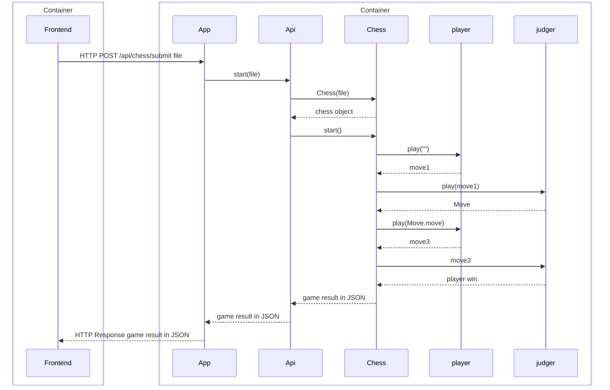
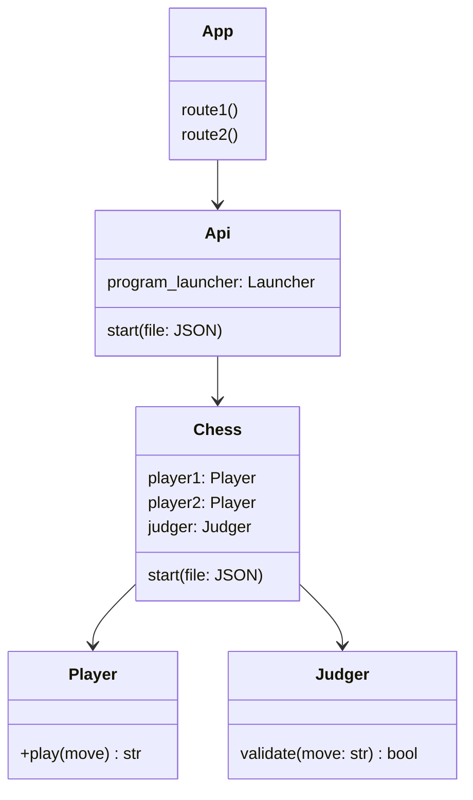

# Architecture

## Submitting file from front-end and run chess game

```mermaid
sequenceDiagram

Frontend ->> App: HTTP POST /api/chess/submit file
App ->> Api: start(file)
Api ->> Chess: Chess(file)
Chess -->> Api: chess object
Api ->> Chess: start()
Chess ->> player: play("")
player -->> Chess: move1
Chess ->> judger: play(move1)
judger -->> Chess: Move
Chess ->> player: play(Move.move)
player -->> Chess: move3
Chess ->> judger: move3
judger -->> Chess: player win
Chess -->> Api: game result in JSON
Api -->> App: game result in JSON
App -->> Frontend: HTTP Response game result in JSON

box Container
    participant Frontend
end

box Container
    participant App
    participant Api
    participant Chess
    participant player
    participant judger
end
```

## Backend

```mermaid
classDiagram

App --> Api
Api --> Chess
Chess --> Player
Chess --> Judger

class Chess {
    start(file: JSON)
    player1: Player
    player2: Player
    judger: Judger
}

class Judger {
    validate(move: str) bool
}

class Player {
    +play(move) str
}

class Api {
    start(file: JSON)
    program_launcher: Launcher
}

class App {
    route1()
    route2()
}
```
