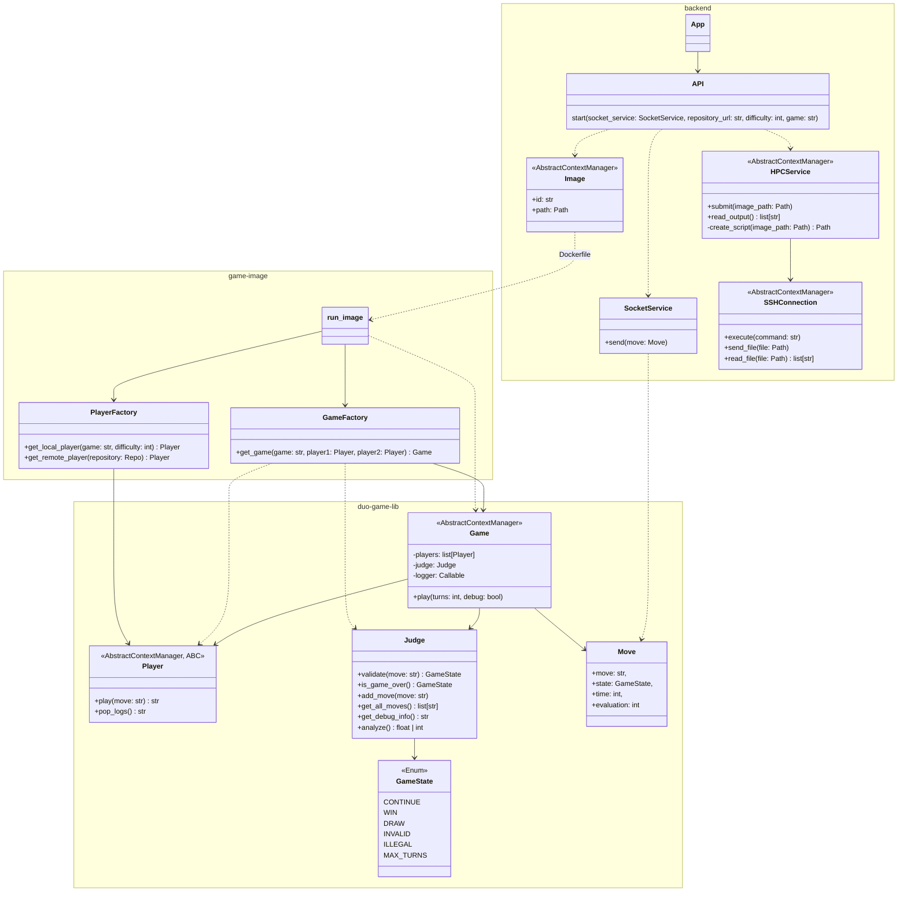
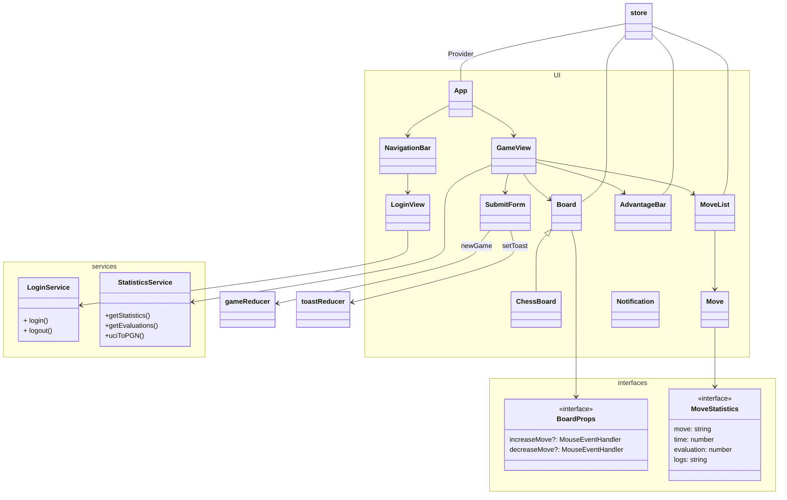

# Architecture

## Sequence diagrams

### Submitting AI and playing a game


> [!NOTE]
> Python context manager closes connections and removes temporary files.

## Backend



> [!NOTE]
>
> - `Player` represents AI, both local and repository-based.
>   It is responsible for providing unified interface across different engines.
> - `game-image` currently contains chess-related classes that should be moved to own repository, see [#18](https://github.com/game-ai-platform-team/tira-ai-platform/issues/18)

## Frontend

Frontend uses React Redux to store and access states.

### UI architecture



### React Redux part

#### The structure of store

```ts
{
    moves: Array<MoveStatistics>(),
    game: {
        isGameRunning: boolean,
        state: GameState,
        config: GameConfig,
    },
    boards: {
        chessBoards: Array<string>,
        connectFourBoards: Array<Array<number>>,
    },
    boardIndex: number,
    logs: string,
    notification: {
        title: string,
        text: string,
        color: string,
    }
}
```

#### Actions

- moves
  - createMove
  - resetMoves
- game
  - newGame
  - resetGame
  - updateState
- boards
  - new\<GameName\>Board
  - reset\<GameName\>Boards
- boardIndex
  - setBoardIndex
  - nextBoard
  - previousBoard
  - resetBoardIndex
- logs
  - setLog
  - resetLogs
- notification
  - setToast
