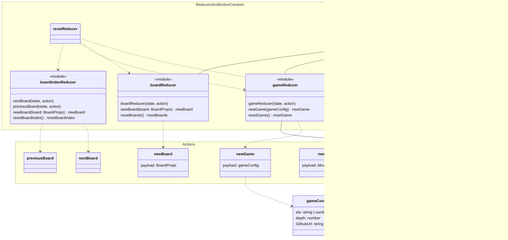

# Architecture

## Submitting file from front-end and run chess game

## Container Game Flow

- Periodic data is sent every time a move is validated. This is described by the dotted arrow.
- The cycle described by the line arrow only occurs once.
- Container architecture will probably change
- Factory class is responsible for instantiating correct player1, player2, validator

## Architecture draft

## Backend

## Frontend

Frontend uses React Redux to store and access states.

### UI architecture

### React Redux part and logic

