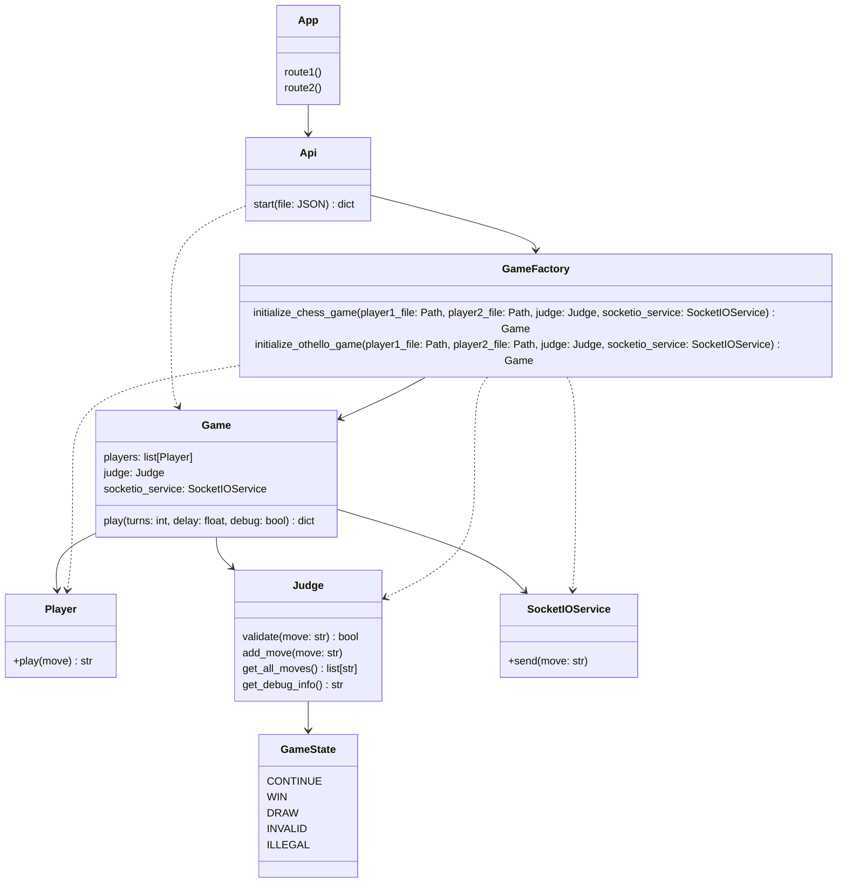

# Architecture

## Submitting file from front-end and run chess game

## Container Game Flow

- Periodic data is sent every time a move is validated. This is described by the dotted arrow.
- The cycle described by the line arrow only occurs once.
- Game container is separate from app because we're running a foreign script in it.
- Factory class is responsible for instantiating correct player1, player2, validator

## Initial architecture draft

## Backend

